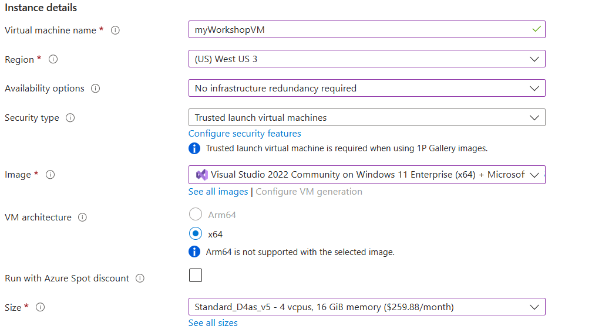
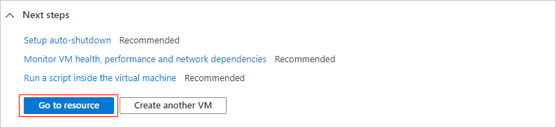

# Create a Windows virtual machine in the Azure portal with Visual Studio Community

Azure virtual machines (VMs) can be created through the Azure portal. This method provides a browser-based user interface to create VMs and their associated resources. This quickstart shows you how to use the Azure portal to deploy a virtual machine (VM) in Azure that runs Windows Server 2022 Datacenter. To see your VM in action, you then RDP to the VM and install the IIS web server.

## Sign in to Azure
Sign in to the [Azure portal](https://portal.azure.com/)

## Create virtual machine

1. Enter virtual machines in the search.

2. Under Services, select Virtual machines.

3. In the Virtual machines page, select Create and then Azure virtual machine. The Create a virtual machine page opens.

4. Under Instance details, enter myVM for the Virtual machine name and choose "Visual Studio 2022 Community on Windows 11 Enterprise"  for the Image. Leave the other defaults.

5. Under Administrator account, provide a username, such as azureuser and a password. The password must be at least 12 characters long and meet the defined complexity requirements.

6. Under Inbound port rules, choose Allow selected ports and then select RDP (3389) and HTTP (80) from the drop-down.

7. Leave the remaining defaults and then select the Review + create button at the bottom of the page.

8. After validation runs, select the Create button at the bottom of the page. Screenshot showing that validation has passed. Select the Create button to create the VM.

9. After deployment is complete, select Go to resource.

> [!NOTE]
> Please ensure that you turn off the virtual machine when it is not in use to avoid incurring unnecessary costs.

### Connect to virtual machine
Create a remote desktop connection to the virtual machine. These directions tell you how to connect to your VM from a Windows computer. On a Mac, you need an RDP client such as this Remote Desktop Client from the Mac App Store.

1. On the overview page for your virtual machine, select the Connect > RDP.

2. In the Connect with RDP tab, keep the default options to connect by IP address, over port 3389, and click Download RDP file.

3. Open the downloaded RDP file and click Connect when prompted.

4. In the Windows Security window, select More choices and then Use a different account. Type the username as localhost\username, enter the password you created for the virtual machine, and then click OK.

5. You may receive a certificate warning during the sign-in process. Click Yes or Continue to create the connection.

6. Now you are connected to the VM. Enjoy the ride!

## References
[Quickstart: Create a Windows virtual machine in the Azure portal](https://learn.microsoft.com/en-us/azure/virtual-machines/windows/quick-create-portal)